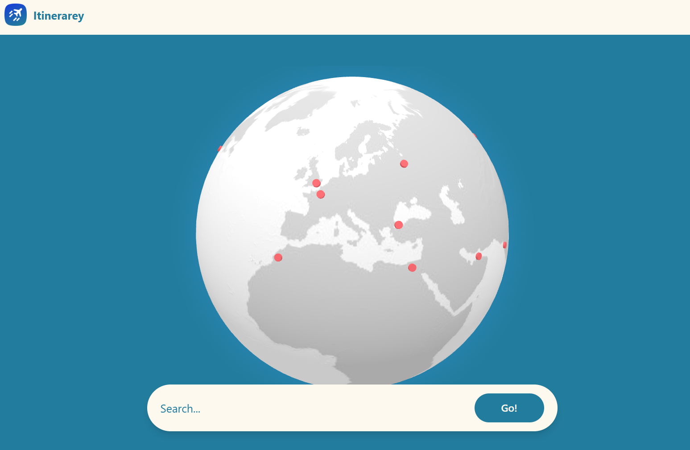

# Itinerarey

The better way to plan out your trips! Itinerarey takes data from across the internet to find flights, hotels, and activities all across the world.

[Try it out!](https://itinerarey.vercel.app/)

## About
Itinerarey was built to make people spend less time stressing out over their vacations, and more time actually enjoying it! The features include:
* AI-backed activity searching!
* Live flight & hotel data, with prices and more!
* Budgeting that automatically excludes anything outside the price range!
* Fully customizable and savable trips!
* Even More!

### How it Works
Itinerarey is a React + Typescript website with TailwindCSS for styling, hosted on Vercel. The website's entire system revolves around a user's localstorage, meaning that their trip is saved locally on their browser. A user starts on the planning page, where they put in information about their trip, such as budgets, locations, dates, and more. Then, they are brought to the flight screen.
 
Using geolocation, a 100km radius is drawn from a location, where all airports in the circle are returned. This is done via mapbox, due to it having a better usage policy than nominatim. A user then chooses their airports, and a python FastAPI server running on **Render.com** is called, returning all flights in the price range. This works by scraping Google Flights, and returning the data from the webpage. Once a user chooses their flights, they go to the hotels screen!
 
The hotels screen works in a similar fashion. Using a Booking.com scraper, the top 25 results for that location are shown, which its price. The user can than select their choice and move to the activities section. The activities for a city are queued from Gemini, which returns a wide range of things they can do throughout their trip. The user can select as many as they want, before they finally end up on the recap page.
 
The recap page shows all of the information the user chose previously, including their flights and hotels (which now have links for Google Flights and Booking.com, respectively), and the activities they have chose. Under this, a budget overview is shown, with how much this supposed trip would cost and the possible savings! Finally, a user can save their trip to their files, and then reset the localstorage to go again!

### Running Locally
To run locally, start by cloning the repo and installing all packages with `npm i`. Then, you need to create your own **.env**, containing a **VITE_MAPBOX_TOKEN**, **VITE_HOTEL_API_KEY**, and **VITE_GEMINI_API_KEY**, which you can get at [Mapbox.com](mapbox.com), [omkar.cloud](omkar.cloud), and [Google AI Studio](https://aistudio.google.com/). Then, you can finally run on port 5173 with `npm run dev`!

### Acknowledgements
* [Fast Flights, which returns the flight data for each trip](https://pypi.org/project/fast-flights/)
* [Omkar.cloud's Booking.com scraper](https://www.omkar.cloud/tools/booking-scraper/about)
* [cally, a lightweight calendar for javascript](https://wicky.nillia.ms/cally/)
* [Mapbox, for geolocation purposes](https://www.mapbox.com/)
* [madzia](https://stardance.hackclub.com/@madzia), for their constant support!

### Enjoy!
by nate (np3)

Shield: [![CC BY-NC-SA 4.0][cc-by-nc-sa-shield]][cc-by-nc-sa]

This work is licensed under a
[Creative Commons Attribution-NonCommercial-ShareAlike 4.0 International License][cc-by-nc-sa].

[![CC BY-NC-SA 4.0][cc-by-nc-sa-image]][cc-by-nc-sa]

[cc-by-nc-sa]: http://creativecommons.org/licenses/by-nc-sa/4.0/
[cc-by-nc-sa-image]: https://licensebuttons.net/l/by-nc-sa/4.0/88x31.png
[cc-by-nc-sa-shield]: https://img.shields.io/badge/License-CC%20BY--NC--SA%204.0-lightgrey.svg
